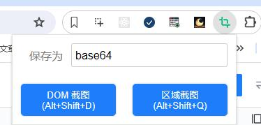
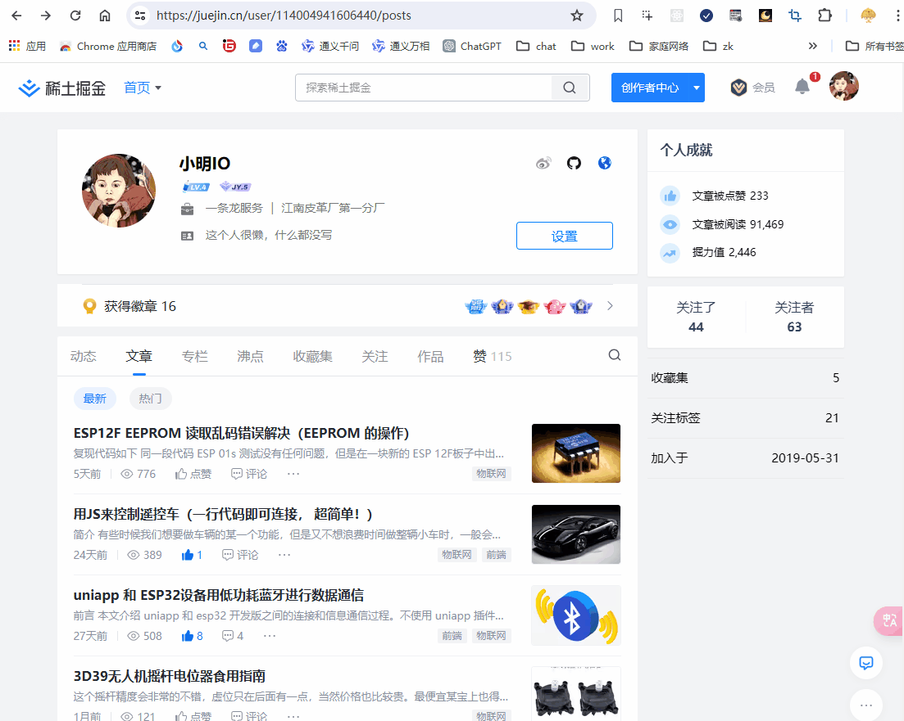

# web-screenshot
一个浏览器扩展，可以选择页面中某个 DOM 元素进行截图，也可以框选某个区域进行截图。喜欢的话给我个 star 吧~ 

软件主页：<a href="https://xiaomingio.top/web-screenshot/">点击跳转</a> 

Chrome 商店安装：<a href="https://chromewebstore.google.com/detail/web-screenshot/pmjofmnlelohbkcclejgenpfgpfchbjo?hl=zh-CN&authuser=0">点击跳转</a>

A browser extension that can select a DOM element in the page to take a screenshot, and can also select an area to take a screenshot.
Give me a star if you like

Software Homepage: <a href="https://xiaomingio.top/web-screenshot/">点击跳转</a> 

Chrome Store：<a href="https://chromewebstore.google.com/detail/web-screenshot/pmjofmnlelohbkcclejgenpfgpfchbjo?hl=zh-CN&authuser=0">点击跳转</a>

## 浏览器支持度 | Browser support

支持所有常见的基于 Chromium 的现代浏览器： Chrome、Edge、360急速浏览器、搜狗、QQ浏览器... 

Support for all common Chromium-based modern browsers: Chrome, Edge, 360 Quick browser, Sogou, QQ browser...

 
## Screenshots 

## Video

## 安装 | Install
推荐使用 Chrome 应用商店安装，如果你无法使用Chrome商店，则使用软件主页中的方法
<a href="https://xiaomingio.top/web-screenshot/">软件主页</a>

The Chrome App Store installation is recommended, or if you can't use the Chrome Store, use the method on the software home page
<a href="https://xiaomingio.top/web-screenshot/">Software homepage</a>

 

## 微信交流群 | Wechat communication group 

## 文章 | Article 
掘金：https://juejin.cn/spost/7369270223868674111